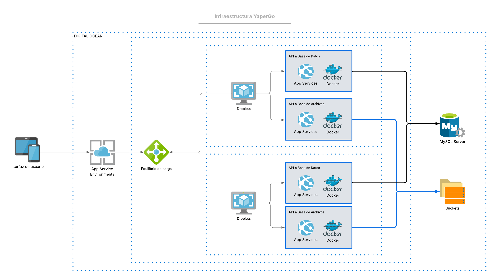

# 🚀 Guía de Despliegue YaperGo en DigitalOcean

  


Esta guía te ayudará a desplegar [YaperGo](https://github.com/ISCOUTB/AH-YaperGoUTB) y sus respectivas APIs en DigitalOcean usando Terraform y Ansible de manera sencilla.

  

## 📋 Arquitectura

  


---

  

## 💻 **¿Desde qué máquina puedo desplegar?**

  

### ✅ **Opción 1: Ubuntu/Linux (RECOMENDADO)**

La opción más fácil y sin complicaciones:

-  **Ubuntu 22.04 LTS** (Desktop o Server)

-  **Debian**, **CentOS**, **Arch Linux**

- Cualquier **Raspberry Pi 4** con Linux

  

### ✅ **Opción 2: Windows con WSL2 (RECOMENDADO)**

Linux dentro de Windows, muy fácil de configurar:

```powershell

# En PowerShell como administrador:

wsl --install -d Ubuntu

# Reinicia y sigue las instrucciones de Linux

```

  

### ⚠️ **Opción 3: Windows nativo**

Más complejo, requiere adaptaciones adicionales (ver scripts específicos más abajo).

  

### 🐳 **Opción 4: Cualquier OS con Docker**

Si no quieres instalar nada directamente en tu sistema.

  

---

  

## 🛠️ Requisitos Previos

  

### 1. Recursos mínimos de tu máquina

-  **RAM**: 2GB disponibles mínimo

-  **Disco**: 10GB libres

-  **Internet**: Conexión estable (descarga ~500MB)

-  **Tiempo**: Primera ejecución 10-15 minutos

  

### 2. Instalación de herramientas (Linux/WSL2)

```bash

# Actualizar sistema

sudo  apt  update && sudo  apt  upgrade  -y

  

# Instalar Terraform

wget  -O-  https://apt.releases.hashicorp.com/gpg  |  sudo  gpg  --dearmor  -o  /usr/share/keyrings/hashicorp-archive-keyring.gpg

echo  "deb [signed-by=/usr/share/keyrings/hashicorp-archive-keyring.gpg] https://apt.releases.hashicorp.com $(lsb_release  -cs) main"  |  sudo  tee  /etc/apt/sources.list.d/hashicorp.list

sudo  apt  update && sudo  apt  install  terraform

  

# Instalar Ansible y dependencias

sudo  apt  install  ansible  jq  curl  git  openssh-client  -y

  

# Generar clave SSH (si no tienes una)

ssh-keygen  -t  rsa  -b  4096  -C  "tu-email@ejemplo.com"

```

  

### 3. Instalación en Windows nativo

```powershell

# Descargar e instalar manualmente:

# 1. Terraform: https://terraform.io/downloads.html

# 2. Git for Windows: https://git-scm.com/

# 3. Python 3: https://python.org/

# 4. Ansible vía pip: pip install ansible

```

  

### 4. Cuenta de DigitalOcean

- Crea una cuenta en [DigitalOcean](https://digitalocean.com)

- Genera un token de API desde el panel de control

- Sube tu clave SSH pública al panel de control

  

### 5. Imágenes Docker

Asegúrate de que las siguientes imágenes estén disponibles en DockerHub:

-  `dcruz04/yapergo-web:dev` - Tu aplicación principal

-  `dcruz04/yapergo-api1:dev` - API que se conecta a MySQL

-  `dcruz04/yapergo-api2:dev` - API que se conecta al Bucket

---

## 🚀 Pasos de Instalación

  

### Método A: Linux/WSL2 (Recomendado)

  

#### Paso 1: Preparar archivos de configuración

  

**Configura las variables en `terraform.tfvars`:**

```hcl
do_token = "dop_v1_tu_token_real_aqui"
ssh_key_name = "nombre-de-tu-clave-ssh"

docker_api1_image = "dcruz04/yapergo-web:dev"
docker_api2_image = "dcruz04/yapergo-api1:dev"
app_docker_image = "dcruz04/yapergo-api2:dev"
```

#### Paso 2: Ejecutar el despliegue

```bash
# Hacer el script ejecutable
chmod  +x  deploy.sh

# Ejecutar el despliegue completo
./deploy.sh
```

### Método B: Windows nativo

  

#### Paso 1: Preparar archivos

Configura `terraform.tfvars` igual que arriba.

  

#### Paso 2: Ejecutar en PowerShell
```powershell
# Ejecutar el script de PowerShell
.\deploy.ps1

# Después ejecutar Ansible en WSL2 o Linux:
wsl
ansible-playbook -i inventory_dynamic.ini playbook.yml
```

### Método C: Usando Docker (cualquier OS)

#### Paso 1: Preparar archivos
Configura `terraform.tfvars` igual que arriba.

  

#### Paso 2: Ejecutar con Docker

```bash
# Hacer ejecutable y ejecutar

chmod  +x  docker-deploy.sh

./docker-deploy.sh
```

### Paso 3: Verificar el despliegue

El script te mostrará:

- URL de tu aplicación

- IP del Load Balancer

- URLs de las APIs

---

## 📁 Estructura de Archivos

```

mi-proyecto/

├── main.tf # Configuración principal de Terraform
├── terraform.tfvars # Variables de configuración (¡NO subir a Git!)
├── inventory.ini # Inventario base de Ansible
├── playbook.yml # Configuración de los droplets
├── deploy.sh # Script de despliegue para Linux/WSL2
├── deploy.ps1 # Script de despliegue para Windows
├── docker-deploy.sh # Script usando Docker
└── README.md # Esta guía

```

---

## 🖥️ **Configuración por Sistema Operativo**

  

### 🐧 **Ubuntu/Linux (La más fácil)**

```bash

# Todo funciona directamente

sudo  apt  update

sudo  apt  install  terraform  ansible  jq  git  -y

./deploy.sh

```

### 🪟 **Windows con WSL2 (Recomendado)**

```powershell

# 1. Instalar WSL2
wsl --install -d Ubuntu

# 2. Reiniciar Windows

# 3. Abrir WSL2 y seguir pasos de Linux
wsl
sudo apt update && sudo apt install terraform ansible jq git -y
```

### 💻 **Windows nativo (Más complejo)**
```powershell
# 1. Instalar manualmente:
# - Terraform desde terraform.io
# - Git for Windows
# - Python 3 y pip install ansible

# 2. Usar PowerShell:
.\deploy.ps1

# 3. Para Ansible necesitarás WSL2 o Docker
```

### 🐳 **Docker (Cualquier OS)**

```bash

# Solo necesitas Docker instalado

./docker-deploy.sh

```

  

---

  

## ⚙️ **Consideraciones especiales por plataforma**

  

### WSL2 en Windows:

```bash

# Acceder a archivos de Windows desde WSL2:

cd  /mnt/c/Users/TuUsuario/mi-proyecto

  

# Compartir claves SSH entre Windows y WSL2:

cp  /mnt/c/Users/TuUsuario/.ssh/id_rsa  ~/.ssh/

chmod  600  ~/.ssh/id_rsa

```

  

### macOS:

```bash

# Instalar con Homebrew

brew  install  terraform  ansible  jq

  

# El resto es igual que Linux

./deploy.sh

```

  

---

  

## 🔧 Configuración Manual (Alternativa)

  

Si prefieres ejecutar paso a paso:

  

```bash

# 1. Inicializar Terraform

terraform  init

  

# 2. Ver el plan de despliegue

terraform  plan

  

# 3. Aplicar la configuración

terraform  apply

  

# 4. Obtener las IPs de los droplets

terraform  output  droplet_ips

  

# 5. Actualizar inventory.ini con las IPs reales

# Reemplaza DROPLET_IP_1 y DROPLET_IP_2 con las IPs obtenidas

  

# 6. Configurar los droplets con Ansible

ansible-playbook  -i  inventory.ini  playbook.yml

```

  

---

  

## 🔍 Verificación y Pruebas

  

### Comprobar que todo funciona:

  

```bash

# Obtener la IP del Load Balancer

LB_IP=$(terraform  output  -raw  load_balancer_ip)

  

# Probar el health check

curl  http://$LB_IP/health

  

# Probar las APIs

curl  http://$LB_IP/api1/

curl  http://$LB_IP/api2/

  

# Ver la aplicación

echo  "Tu app está en: $(terraform output -raw app_url)"

```

  

---

  

## 📊 Monitoreo

  

### Ver logs de los contenedores:

```bash

# Conectar a un droplet

ssh  root@DROPLET_IP

  

# Ver logs de las APIs

docker  logs  api1

docker  logs  api2

  

# Ver estado de los contenedores

docker  ps

```

  

---

  

## 🛡️ Seguridad

  

### Variables de entorno importantes:

-  `DATABASE_URL`: Se pasa automáticamente a API 1

-  `BUCKET_NAME`: Se pasa automáticamente a API 2

-  `SPACES_KEY` y `SPACES_SECRET`: Configúralos en el playbook si es necesario

  

### Firewall:

El playbook configura automáticamente:

- Puerto 22 (SSH)

- Puerto 80 (HTTP)

- Puerto 443 (HTTPS)

  

---

  

## 🧹 Limpieza

  

Para eliminar toda la infraestructura:

  

```bash

terraform  destroy

```

  

---

  

## ❓ Solución de Problemas

  

### 🔧 **Problemas comunes por plataforma:**

  

#### **Windows:**

```powershell

# Error: "terraform no se reconoce"

# Solución: Agregar Terraform al PATH del sistema

  

# Error: "ansible no funciona"

# Solución: Usar WSL2 para Ansible

wsl

ansible-playbook -i inventory.ini playbook.yml

```

  

#### **WSL2:**

```bash

# Error: "Permission denied" con claves SSH

chmod  600  ~/.ssh/id_rsa

ssh-add  ~/.ssh/id_rsa

  

# Error: No puede conectar a Docker

# Solución: Instalar Docker Desktop y habilitar WSL2 integration

```

  

#### **Linux:**

```bash

# Error: "snap terraform" no funciona bien

# Solución: Usar la instalación oficial con wget

wget  -O-  https://apt.releases.hashicorp.com/gpg  |  sudo  gpg  --dearmor  -o  /usr/share/keyrings/hashicorp-archive-keyring.gpg

```

  

### 🌐 **Errores de red y SSH:**

```bash

# Error: "SSH connection failed"

# Verificar que tu clave SSH esté en el agente

ssh-add  ~/.ssh/id_rsa

  

# Probar conexión manual

ssh  root@DROPLET_IP

  

# En Windows, usar Git Bash o WSL2 para SSH

```

  

### 🐳 **Errores de Docker:**

```bash

# Error: "Docker images not found"

# Verifica que las imágenes estén públicas en DockerHub

# Asegúrate de usar los nombres correctos en terraform.tfvars

  

# Error: "Docker daemon not running" (en WSL2)

sudo  service  docker  start

# O instalar Docker Desktop para Windows

```

  

### 🗄️ **Errores de base de datos:**

```bash

# Error: "Database connection failed"

# Las credenciales se generan automáticamente

# Verifica la variable DATABASE_URL en los logs del contenedor

terraform  output  -raw  database_connection

```

  

### ⚖️ **Load Balancer no responde:**

```bash

# Conectar al droplet y verificar servicios

ssh  root@DROPLET_IP

systemctl  status  nginx

systemctl  status  docker

docker  ps

```

  

---

  

## 📊 **Tabla de compatibilidad:**

  

| Sistema | Dificultad | Tiempo Setup | Funciona | Recomendado |

|---------|------------|--------------|----------|-------------|

| Ubuntu/Debian | ⭐ Fácil | 10 min | ✅ 100% | ✅ **SÍ** |

| WSL2 Windows | ⭐⭐ Medio | 15 min | ✅ 100% | ✅ **SÍ** |

| macOS | ⭐ Fácil | 10 min | ✅ 100% | ✅ Sí |

| Windows nativo | ⭐⭐⭐ Difícil | 30 min | ⚠️ 80% | ❌ No |

| Docker anywhere | ⭐⭐ Medio | 20 min | ✅ 95% | ⚠️ Alternativa |

| Raspberry Pi | ⭐⭐ Medio | 15 min | ✅ 100% | ✅ Sí |

---
  
## 📞 Soporte

Si tienes problemas:

1. Revisa los logs de Terraform: `terraform show`

2. Revisa los logs de Ansible: añade `-v` al comando ansible-playbook

3. Verifica el estado de los servicios en los droplets

---
  
## 💡 Consejos por plataforma

### 🐧 **Linux/Ubuntu (Principiantes):**

- Usa Ubuntu 22.04 LTS Desktop en VirtualBox si no tienes Linux nativo

- Todos los comandos funcionan exactamente como están escritos

- Es la experiencia más limpia y sin problemas

### 🪟 **Windows (Recomendaciones):**

```powershell

# Opción 1: WSL2 (MÁS FÁCIL)

wsl --install -d Ubuntu

# Después todo es como Linux

  

# Opción 2: Git Bash para scripts

# Instalar Git for Windows y usar Git Bash

  

# Opción 3: PowerShell (usar deploy.ps1)

# Para usuarios avanzados de Windows

```

  

### 🐳 **Docker (Usuarios avanzados):**

```bash

# Ventaja: No instala nada en tu sistema

# Desventaja: Más lento y consume más recursos

# Perfecto para: Probar sin comprometerse

```

  

### 🍎 **macOS:**

```bash

# Instalar Homebrew primero

/bin/bash  -c  "$(curl  -fsSL https://raw.githubusercontent.com/Homebrew/install/HEAD/install.sh)"

  

# Después es igual que Linux

brew  install  terraform  ansible  jq

```

---


## 🎯 **Recomendación final:**

  

### **Si eres nuevo y tienes Windows:**

1.  **Instala WSL2** (5 minutos)

2.  **Sigue las instrucciones de Linux** (funciona perfecto)

  

### **Si tienes problemas con WSL2:**

1.  **Usa Ubuntu en VirtualBox** (20 minutos de setup)

2.  **Experiencia 100% compatible**  

### **Si quieres probar sin instalar nada:**

1.  **Usa el método Docker** (funciona en cualquier lado)

2.  **Solo necesitas Docker Desktop**

  
---
  

## 🔒 **Consideraciones de seguridad y costos:**

  

-  **Seguridad**: Nunca subas `terraform.tfvars` a Git (contiene tokens secretos)

-  **Costos**: Los recursos más baratos están seleccionados por defecto (~$25/mes)

-  **Escalabilidad**: Puedes cambiar el número de droplets modificando `count = 2` en `main.tf`

-  **Backup**: DigitalOcean hace backups automáticos de la base de datos

-  **SSH**: Asegúrate de tener una clave SSH configurada antes de empezar

  

¡Tu infraestructura estará lista en unos minutos! 🎉

  

---

  

## 🆘 **¿Necesitas ayuda?**

  

### Por plataforma:

-  **Linux**: Todo debería funcionar sin problemas

-  **Windows**: Usa WSL2, es más fácil que luchar con Windows nativo

-  **macOS**: Instala Homebrew primero, después es como Linux

-  **Docker**: Buena alternativa si no quieres instalar herramientas

  

### Recursos útiles:

- [Instalar WSL2](https://docs.microsoft.com/en-us/windows/wsl/install)

- [Configurar SSH en DigitalOcean](https://docs.digitalocean.com/products/droplets/how-to/add-ssh-keys/)

- [Terraform documentación](https://terraform.io/docs)

  

**¡Recuerda:** Si algo no funciona, WSL2 en Windows es tu mejor amigo. Es Linux dentro de Windows y funciona perfecto. 🚀